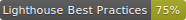
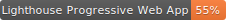
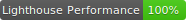

 
 

# Lighthouse Badges

Sorry, currently WIP. Commands and Screenshots coming soon.

## Example Badges

## Author(s)

Emanuele Mazzotta

## License

[MIT License](LICENSE.md) © Emanuele Mazzotta

