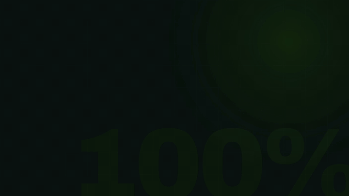
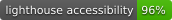
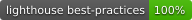
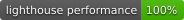
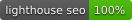
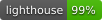

[](https://github.com/emazzotta/lighthouse-badges/actions/workflows/build.yml)
[](https://www.npmjs.org/package/lighthouse-badges)
[](https://www.npmjs.org/package/lighthouse-badges)
[](https://emanuelemazzotta.com/mit-license)

# Lighthouse Badges

[](https://github.com/GoogleChrome/lighthouse)

This package allows you to easily create Lighthouse badges for all Lighthouse categories.  
Ever wanted to brag about your site's awesome Lighthouse performance? Then this is the package for you!  

[](./assets/brag/brag.mp4)

<sub>Music: Happy Beats - Business Moves Vol. 9 by Sascha Ende ([ende.app](https://ende.app)), CC BY 4.0</sub>

## Examples

### All Badges

[](https://github.com/emazzotta/lighthouse-badges)
[](https://github.com/emazzotta/lighthouse-badges)
[](https://github.com/emazzotta/lighthouse-badges)
[](https://github.com/emazzotta/lighthouse-badges)
[](https://github.com/emazzotta/lighthouse-badges)

### Single Badge

[](https://github.com/emazzotta/lighthouse-badges)

## Usage

### Help

```txt
usage: lighthouse-badges [-h] [-v] [-s]
                         [-b {flat,flat-square,plastic,for-the-badge,social}]
                         [-o OUTPUT_PATH] [-r] -u URL

Generate gh-badges (shields.io) based on lighthouse performance.

options:
  -h, --help            show this help message and exit
  -v, --version         Show the version of the tool
  -s, --single-badge    Output only one single badge averaging all lighthouse
                        categories' scores
  -b, --badge-style {flat,flat-square,plastic,for-the-badge,social}
                        Define look and feel for the badge
  -o, --output-path OUTPUT_PATH
                        Define output path for artifacts
  -r, --save-report     Save the lighthouse report as html next to the badges

Required arguments:
  -u, --url URL         The url whose lighthouse scores the badge(s) will show
```

Additionally, you can pass parameters configurations to the lighthouse process directly via environment variable path to the config file:

```bash
# The variable name matters, but the path can be anything
export LIGHTHOUSE_BADGES_CONFIGURATION_PATH="~/.lhb-config.json" 

# "extends": "lighthouse:default" is needed, the rest is optional
cat << EOF >! $LIGHTHOUSE_BADGES_CONFIGURATION_PATH
{
  "extends": "lighthouse:default",
  "settings": {
    "extraHeaders": {
      "Authorization": "Bearer ..."
    },
    "onlyCategories": [
      "performance",
      "pwa"
    ],
    "formFactor": "mobile"
  }
}
EOF

lighthouse-badges --url https://www.youtube.com/
```

See [here](https://github.com/GoogleChrome/lighthouse/blob/main/docs/configuration.md) for more configuration examples in the official lighthouse docs.

### Run

Bun >= 1.0.0 is required.

#### Option 1: bun
```bash
bun install -g lighthouse-badges
lighthouse-badges --url https://www.youtube.com/ -o test_results
```

#### Option 2: bunx
```bash
bunx lighthouse-badges --url https://www.youtube.com/ -o test_results
```

#### Option 3: Docker
```bash
# May alter lighthouse results due to performance differences compared to running directly on host
docker run --rm \
    -v $PWD/test_results:/home/chrome/reports \
    emazzotta/lighthouse-badges \
    /bin/sh -c "lighthouse-badges --url https://www.youtube.com/"
```

### Develop

```bash
bun run start # To run the lighthouse-badges code on google.com
```

## Contributing

See [contribution guideline](./CONTRIBUTING.md)

## Sponsors

Sponsored by [JetBrains](https://www.jetbrains.com/?from=Lighthouse-Badges)

<a href="https://www.jetbrains.com/?from=Lighthouse-Badges">
  
</a>

## Author

[Emanuele Mazzotta](mailto:hello@mazzotta.me)
